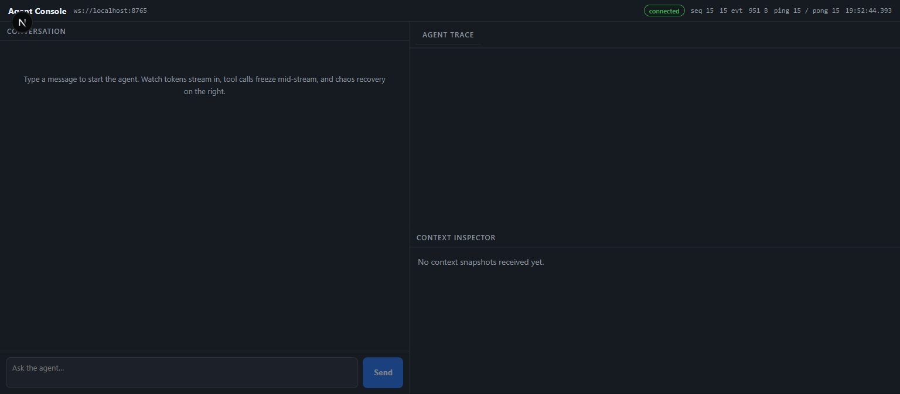
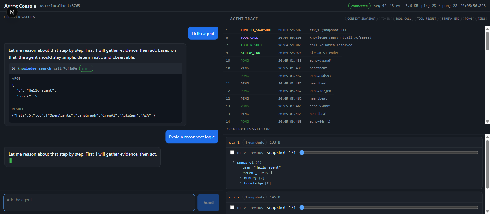
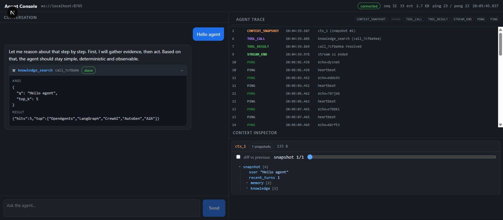
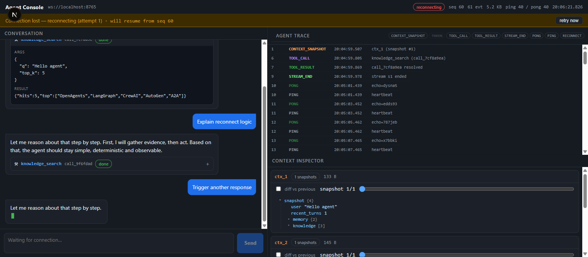
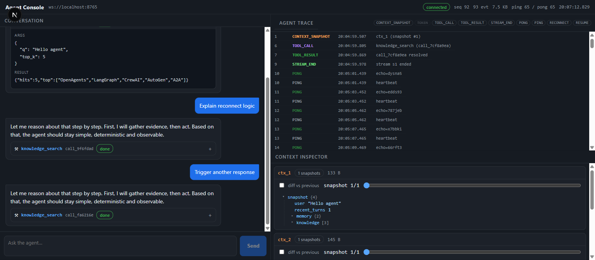

# Agent Console

A hardened, real-time frontend for observing and interacting with an AI agent over WebSocket — built for the [Alchemyst AI](https://alchemystai.com) Agent Console selection task.

The console streams agent tokens character-by-character, freezes tool calls mid-stream into immutable cards, shows a live trace timeline, and inspects the agent's context window — all while surviving injected network chaos: dropped connections, out-of-order events, duplicates, and malformed payloads.

## Demo

| Connected (idle) | Streaming | Tool card |
|---|---|---|
|  |  |  |

| Reconnect banner | Post-reconnect (recovered) |
|---|---|
|  |  |

All screenshots were captured against the bundled mock chaos server. See [DEMO.md](./DEMO.md) for a 2-minute reproduction.

## Architecture

```
src/
├── app/
│   ├── layout.tsx          Root HTML shell + metadata
│   ├── page.tsx            Top-level composition + useAgent wiring
│   └── globals.css         Token-driven design system (single file)
├── components/
│   ├── StatusHeader.tsx    Connection state badge + live stats
│   ├── ReconnectBanner.tsx Amber banner shown only during reconnects
│   ├── ChatPanel.tsx       Scrolling conversation + composer
│   ├── ToolCard.tsx        Collapsible frozen tool call card
│   ├── TraceTimeline.tsx   Virtualized, filterable event log
│   ├── ContextInspector.tsx Snapshot scrubber + JSON tree + diff
│   └── JsonTree.tsx        Recursive JSON viewer + DiffTree
├── hooks/
│   └── useAgent.ts         BrowserWsTransport + AgentEngine React bridge
└── lib/
    ├── types.ts            Protocol + UI TypeScript contracts
    ├── engine.ts           Pure-TS protocol state machine (AgentEngine)
    ├── seqBuffer.ts        Monotone sequence buffer (reorder + dedup)
    ├── diff.ts             Recursive client-side JSON differ
    └── format.ts           Bytes / time / pretty formatters
tests/                      Vitest suites for engine, seq buffer, diff
mock-agent/
└── server.js               Mock agent + chaos injector (ws://localhost:8765)
```

**Key idea:** all protocol logic lives in a pure-TS `AgentEngine` that takes a `Transport` interface. React only subscribes via a `notify()` callback and renders immutable snapshots. This makes the engine fully testable in Node without a DOM.

## Protocol features

The console speaks JSON-over-WebSocket. Every server event carries `{ seq, type, ts }`.

- **Ordered delivery** — all events pass through a `SeqBuffer` that holds out-of-order events and drains them strictly by sequence. Duplicates are dropped.
- **Gap recovery watchdog** — if a sequence gap never fills within 1.5 s, the client forces a reconnect (code 4002) to trigger a server replay instead of stalling silently.
- **Reconnect + RESUME** — on reconnect the client sends `{ type: "RESUME", last_seq: N }`; the server replays events `> N` and the buffer dedups the overlap. No missed events, no double-applied tokens.
- **Heartbeat** — responds to `PING` with `PONG` (echo preserved), tracked in the header stats.
- **Exponential backoff** — `500 ms × 2^n`, capped at 8 s, with a configurable give-up limit.
- **Malformed payload tolerance** — bad JSON, non-objects, and missing `seq`/`type` are logged to the trace and ignored instead of crashing the client.

## UI features

- **Streaming chat** — token-by-token rendering with a blinking cursor; auto-scrolls.
- **Frozen tool cards** — a tool call freezes the response mid-stream; the card expands to show `args` + `result` and stays immutable after completion.
- **Trace timeline** — virtualized (manual scroll-window, no library), kind-based filtering, 1,500-row cap, `TOKEN` hidden by default.
- **Context inspector** — per-context snapshot scrubber with a JSON tree and a diff-vs-previous view computed client-side.
- **Reconnect banner + stats** — explicit `reconnecting` / `gave up` states with a manual retry, plus live `seq`, event count, bytes, and ping/pong stats.

## Chaos testing

`mock-agent/server.js` simulates a flaky agent endpoint so you can watch the console recover in real time:

- **Forced disconnect every 3rd message** — the socket closes mid-stream; the client reconnects, sends `RESUME`, and the server replays the tail of the stream.
- **Out-of-order delivery** — event pairs are shuffled before sending (≈60% of replies).
- **Duplicates** — an event is re-sent with the same `seq` (≈40% of replies); the client dedups it.
- **Malformed payload** — raw non-JSON is injected on every 4th message.
- **Delayed streaming** — events are emitted at 60 ms intervals so tokens visibly stream.
- **Heartbeats** — `PING` every 2 s to verify liveness.

## Tech stack

- **Next.js 15** (App Router) + **React 19** + TypeScript (strict)
- **Vitest** for unit tests
- **ws** (mock server only) — the client uses the native browser `WebSocket`
- Zero UI/runtime dependencies beyond React/Next

## Local setup

```bash
npm install
```

## Running the app

```bash
npm run dev        # → http://localhost:3000
```

Default WebSocket endpoint is `ws://localhost:8765`. To point elsewhere:

```bash
NEXT_PUBLIC_AGENT_WS_URL=ws://your-agent:8765 npm run dev
```

or set `NEXT_PUBLIC_AGENT_WS_URL` in a `.env.local`.

## Running the mock chaos server

```bash
node mock-agent/server.js   # ws://localhost:8765
```

Keep it running alongside the app to experience the chaos-recovery flow.

## Running tests

```bash
npm run test       # 22 tests across engine / seqBuffer / diff
```

## Production build

```bash
npm run build      # type-checks + builds; emits .next/
npm run start      # serve the production build on http://localhost:3000
```

## Trade-offs

- **Snapshots over subscriptions** — the engine emits full snapshots on every event, so large traces cause a full-page re-render. Fine at this scale; memoization is the escape hatch.
- **No external UI/virtualization libs** — hand-rolled for a bespoke dark terminal aesthetic and a zero-dep bundle; fixed-height trace rows are the constraint.
- **Client-side diff, positional arrays** — recursive key-by-key diff is fast for typical context objects; array inserts appear as `changed` at following indices rather than a single clean `added`.
- **100% client-rendered** — nothing meaningful to server-render for a live WebSocket console; avoids hydration mismatches.
- **Full page reloads are fresh sessions** — the mock server resets its stream for a client that connects without a `RESUME`; reconnects (with `RESUME`) continue the same stream.

## Future improvements

- Human-in-the-loop approval for tool calls (make `TOOL_ACK` opt-in per tool).
- Server-side persistence + bounded replay log so `RESUME` survives app restarts.
- Myers diff for large, insertion-heavy context arrays.
- `React.memo` on panels and slice-level subscription to cut re-renders at scale.
- Unit tests for the mock chaos server itself, plus an end-to-end Playwright suite.
- Message search, markdown/streaming formatting, and configurable theme.
